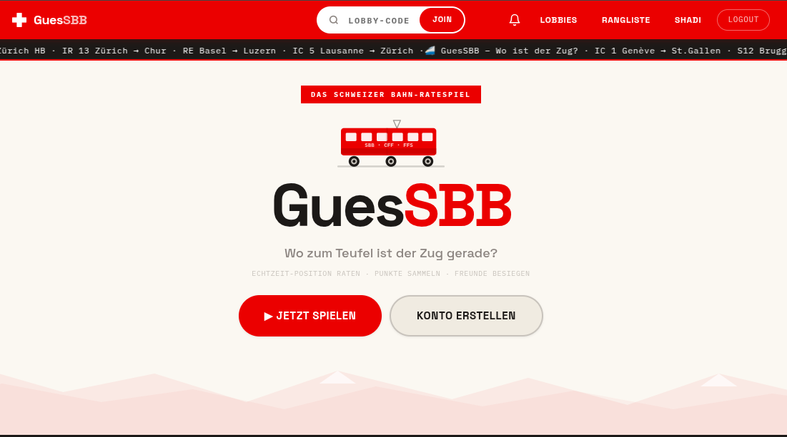
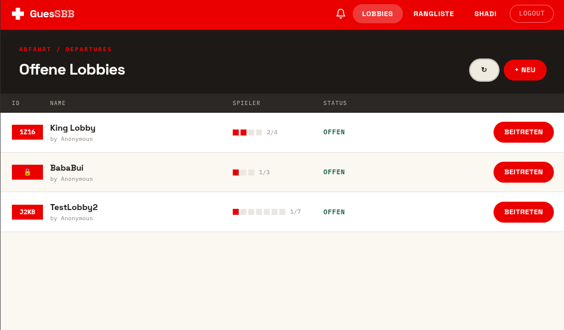
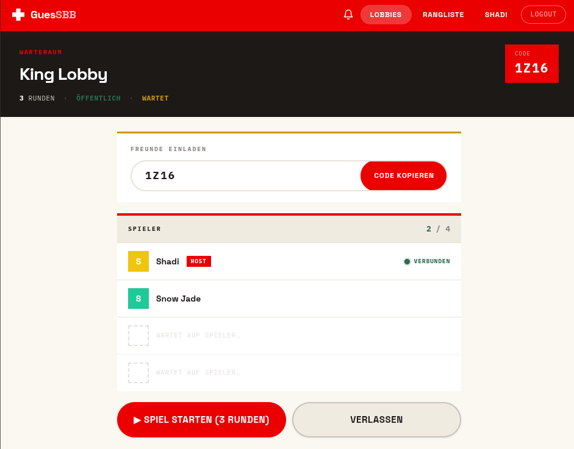
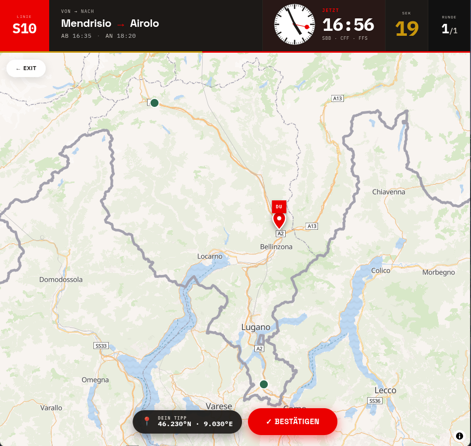
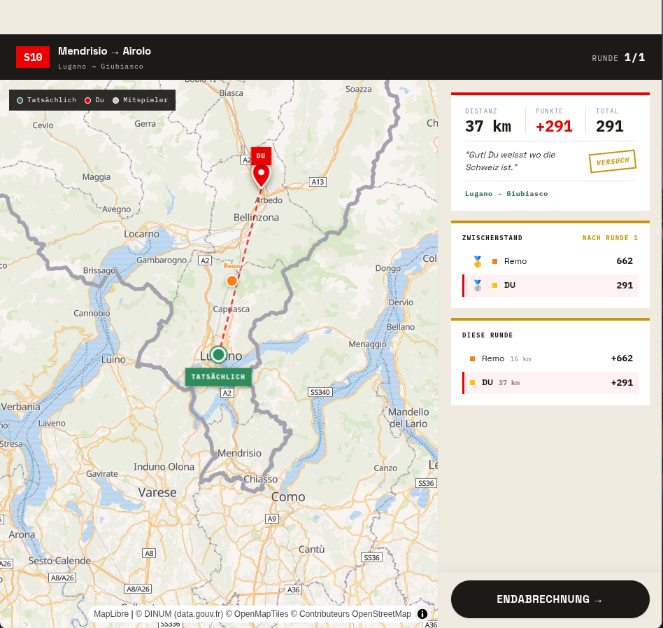

# GuesSBB

GuesSBB is a Swiss train guessing game built with Next.js. The project’s goal is to improve our, and our users’, knowledge about the Swiss train system in a playful way: players have to infer where a train is located based on live route and timetable clues, then place their guess on a map of Switzerland.

## Technologies used

- **Next.js 16** and **React 19** for the frontend
- **TypeScript** for type-safe UI and state handling
- **Ant Design** for UI primitives and notifications
- **MapLibre** for the interactive map in the game view
- **STOMP over SockJS** for real-time lobby/game updates

## High-level components

The application is structured around a small number of shared building blocks that are wired together in [`app/layout.tsx`](app/layout.tsx).

1. **App shell and navigation** [`app/layout.tsx`](app/layout.tsx) and [`app/navbar.tsx`](app/navbar.tsx)
   - `app/layout.tsx` wraps the whole app in the global providers and renders the shared navigation.
   - `app/navbar.tsx` handles the lobby join bar, authentication-aware links, notifications, and the mobile drawer.

2. **Authentication and session state** [`app/context/AuthContext.tsx`](app/context/AuthContext.tsx)
   - Stores the current user and token.
   - Restores sessions from local storage, performs login/logout, and connects to the websocket layer after authentication.

3. **Real-time communication layer** [`app/context/WebSocketContext.tsx`](app/context/WebSocketContext.tsx)
   - Manages the STOMP/SockJS connection to the backend.
   - Provides `connect`, `subscribe`, and `publish` so lobby and game screens can react instantly to backend events.

4. **Lobby discovery and waiting room** [`app/lobbies/page.tsx`](app/lobbies/page.tsx) and [`app/lobbies/[id]/page.tsx`](app/lobbies/[id]/page.tsx)
   - `app/lobbies/page.tsx` shows open lobbies and lets users create or join one.
   - `app/lobbies/[id]/page.tsx` is the lobby waiting room where players gather, copy invite codes, and start the match.

5. **Game round experience** [`app/game/[id]/page.tsx`](app/game/[id]/page.tsx)
   - Displays the current train clues, the map, round timer, guess marker, and the transition between rounds.
   - Uses the websocket layer and resync endpoint to keep the game state consistent.

6. **Leaderboard and social features** [`app/leaderboard/page.tsx`](app/leaderboard/page.tsx)
   - Lets players search others, compare scores, and send friend requests.
   - This page reuses the auth and API helpers to fetch scoreboard and friend data.

These components are correlated through shared contexts and API helpers: `AuthContext` provides identity, `WebSocketContext` powers live updates, and the pages use `useApi` to read and write backend state.

## Launch & deployment

### Prerequisites

- Node.js 20 or newer
- npm
- A running backend API and websocket server

The frontend expects the backend to be available at:

- `http://localhost:8080` in local development
- `https://sopra-fs26-group-15-server.oa.r.appspot.com` in production, unless you override it with `NEXT_PUBLIC_PROD_API_URL`

### Local setup

1. Clone the repository and enter the project folder.
2. Install dependencies:

```bash
npm install
```

3. Start the development server:

```bash
npm run dev
```

4. Open the app in your browser at `http://localhost:3000`.

### Production build

To create a production build and run it locally:

```bash
npm run build
npm run start
```

### Tests and validation

This repository does not currently provide a dedicated test script. The recommended checks for contributors are:

```bash
npm run lint
npm run build
```

These commands validate the code style and ensure the app compiles successfully.

### External dependencies

- The frontend depends on the separate GuesSBB backend for user, lobby, game, friend, and leaderboard data.
- Real-time gameplay and lobby updates require the backend websocket endpoint to be reachable.
- No local database is required for the frontend itself.

### Releases

Releases are handled with semantic-release:

```bash
npm run release
```

In the usual workflow, this is run from the main branch in CI after merging conventional commits. Semantic-release can automatically generate release notes, update the changelog, create a git tag, and publish a GitHub release when the required environment variables are configured.

## Illustrations

The main user flow is:

1. Visit the landing page and click **Jetzt spielen** or **Konto erstellen**.
   
2. Browse available lobbies, create a new one, or join an existing lobby.

    
3. Wait in the lobby until the host starts the match.

    
4. During the game, inspect the train clues and place your guess on the Swiss map.

    
5. Review the round overview and compare your score with the other players.

   
6. Check the leaderboard to see the top players and send friend requests.


If you want screenshots in this README, place them in `docs/screenshots/` and use these names:


- `docs/screenshots/01-home.png` — landing page
- `docs/screenshots/02-lobbies.png` — lobby overview
- `docs/screenshots/03-lobby-room.png` — waiting room
- `docs/screenshots/04-game.png` — in-game map and clues
- `docs/screenshots/05-overview.png` — leaderboard

If you add them later, you can reference them in Markdown like this:

```md
![Landing page image]
![Lobby overview image]
![In-game view image]
```

## Roadmap

Good next contributions for new developers could be:

1. **Add in-game statistics** — show per-round accuracy, average distance, and personal bests in the round overview.
2. **Improve matchmaking and lobby discovery** — add filters for public/private lobbies, player count, and game state.
3. **Expand social features** — invite friends directly from the lobby, add in-app game invites, and improve notification handling.

## Authors and acknowledgment

This project was created by Group 15 as part of the UZH SOPRA course.

Special thanks to the backend team, course supervisors, and everyone who helped shape the GuesSBB idea into a playable Swiss train guessing game.


